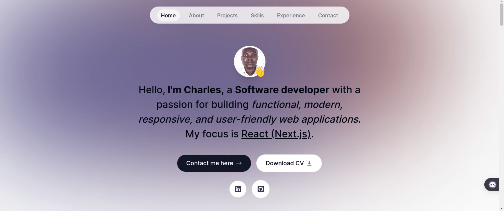
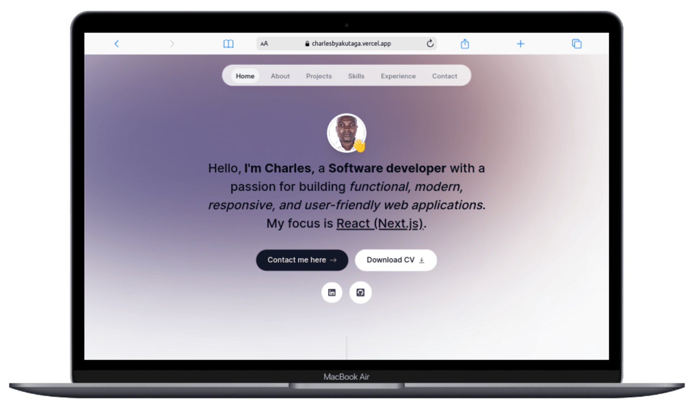
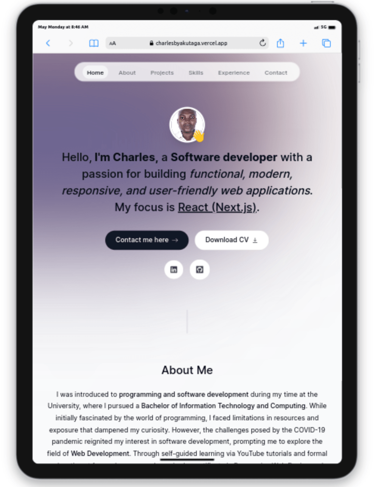
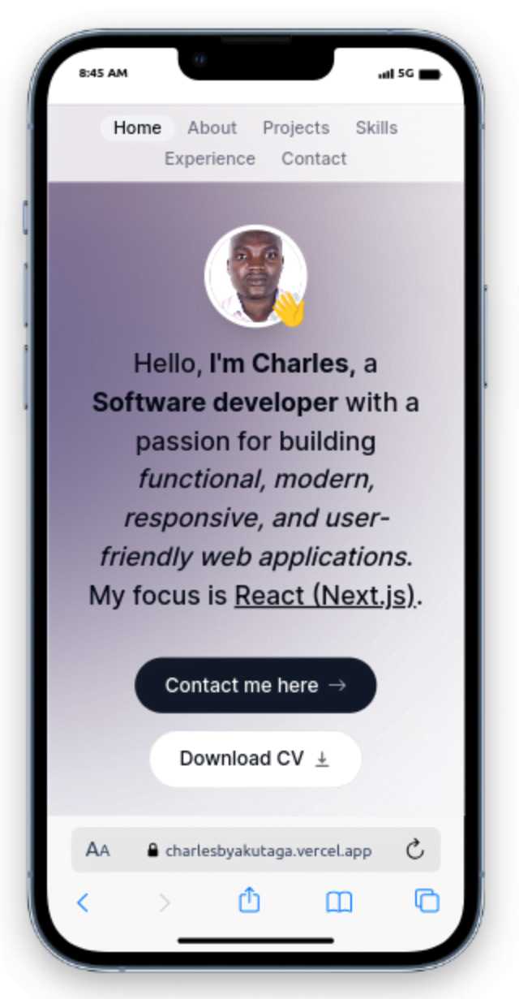

# Personal Portfolio Website (CHARLES BYAKUTAGA)

This single-page portfolio website serves as a comprehensive showcase of my projects, skills, and professional experience. Designed with a clean and modern aesthetic, the site offers visitors a seamless browsing experience, allowing them to explore my key accomplishments, areas of expertise, and the value I can bring to potential employers or collaborators.

The website features a visually striking layout highlighting my most impactful projects, each accompanied by detailed descriptions, screenshots, and links to live demos or code repositories. Visitors can also discover my technical proficiencies, programming language and framework expertise, as well as my educational background and work history.

A standout feature of this portfolio is the ability for visitors to download my detailed professional resume directly from the website. This resume provides a comprehensive overview of my career summary, key qualifications, and employment history, giving potential stakeholders a complete understanding of my background and capabilities.

Overall, this portfolio website serves as a dynamic platform to showcase my skills, passion, and commitment to delivering exceptional results. It is a testament to my dedication to continuous learning and innovative problem-solving

## Screenshots

     
     
     

## Built With

- [React & Next.js(App Router)](https://nextjs.org/) - The React Framework for building Web Applications
- [Typescript](https://www.typescriptlang.org/) - Strongly typed programming language that builds on JavaScript
- [Tailwind CSS](https://tailwindcss.com/) - A utility-first CSS framework
- [Framer Motion](https://www.framer.com/motion/) - An Animation Library
- [EmailJS](https://www.emailjs.com/) - Send Email Directly From Your Code
- [Vercel](https://vercel.com/) - Frontend Cloud for hosting applications

## Live Website

[charlesbyakutaga.vercel.app](https://charlesbyakutaga.vercel.app/)
